# AnimateAnything: Fine-Grained Open Domain Image Animation with Motion Guidance

## 🎬 &nbsp; Animate Image with Text  &nbsp;🎬

<center class = "half">
    <br>
    Reference Image&ensp;&ensp;&ensp;&ensp;&ensp;&ensp;&ensp;&ensp;&ensp;&ensp;&ensp;Results&ensp;&ensp;&ensp;&ensp;&ensp;&ensp;&ensp;&ensp;&ensp;&ensp;&ensp;Reference Image&ensp;&ensp;&ensp;&ensp;&ensp;&ensp;&ensp;&ensp;&ensp;&ensp;&ensp;&ensp;Results&ensp;&ensp;&ensp;
    <br>
    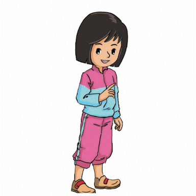 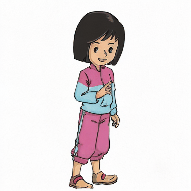
    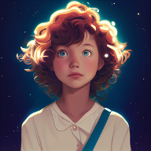
    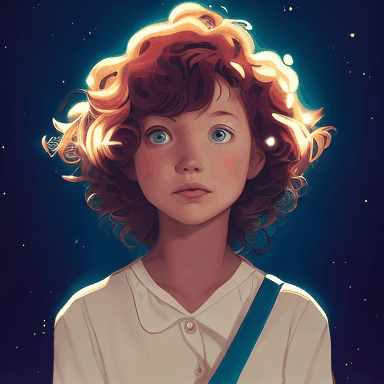
    <br>
    A gril moves hands. &ensp;&ensp;&ensp;&ensp;&ensp;&ensp;&ensp;&ensp;&ensp;&ensp;&ensp;&ensp;&ensp;&ensp;&ensp;&ensp;&ensp;&ensp;&ensp;&ensp;&ensp;&ensp;&ensp;&ensp;&ensp;&ensp;&ensp;&ensp;A boy is smiling.&ensp;&ensp;&ensp;
    <br>
    <br>
    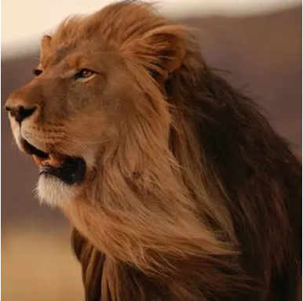
    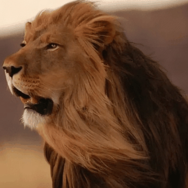
    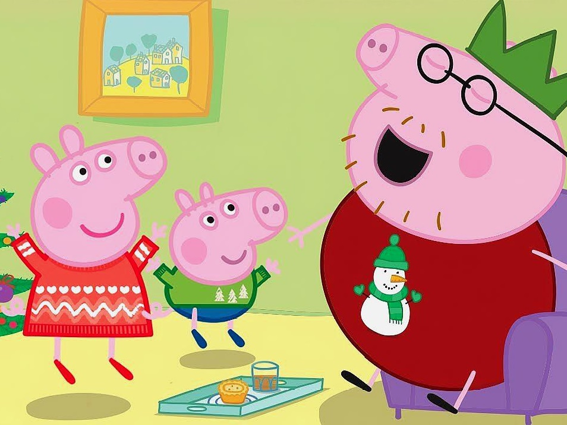
    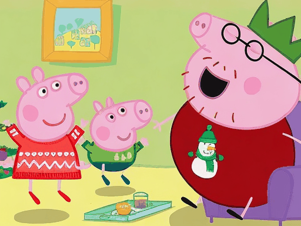
    <br>
        &ensp;&ensp;&ensp;&ensp;&ensp;&ensp;&ensp;A lion moves head. &ensp;&ensp;&ensp;&ensp;&ensp;&ensp;&ensp;&ensp;&ensp;&ensp;&ensp;&ensp;&ensp;&ensp;&ensp;&ensp;&ensp;&ensp;&ensp;&ensp;&ensp;&ensp;&ensp;&ensp;&ensp;&ensp;&ensp;&ensp;&ensp;Cartoon pigs are talking.&ensp;&ensp;
    <br>
    <br>
    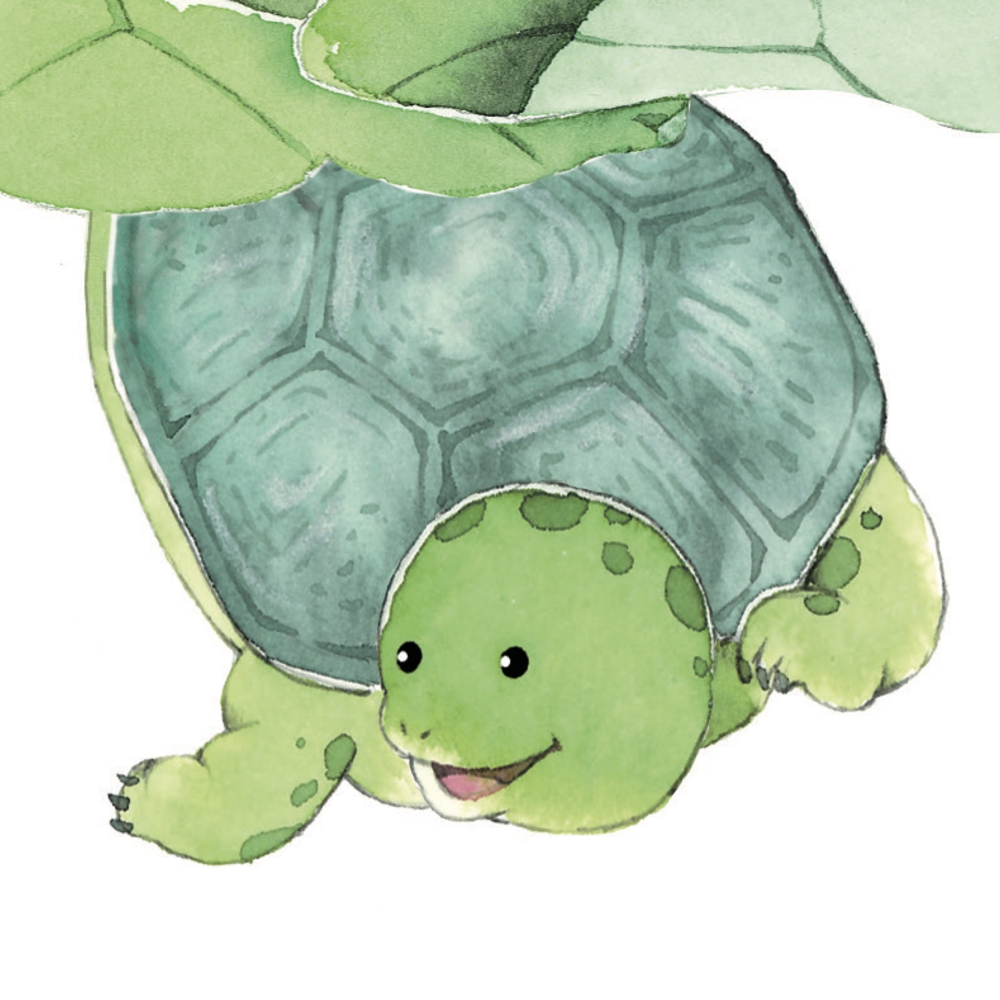
    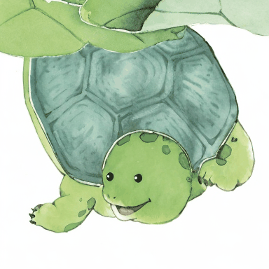
    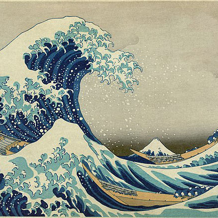
    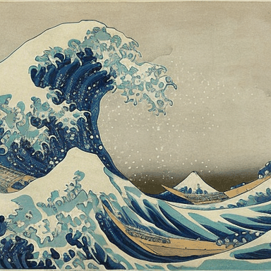
    <br>
   &ensp;&ensp;&ensp;&ensp;&ensp;&ensp;&ensp;&ensp;&ensp; A cartoon turtle is talking.&ensp;&ensp;&ensp;&ensp;&ensp;&ensp;&ensp;&ensp;&ensp;&ensp;&ensp;&ensp;&ensp;&ensp;&ensp;&ensp;&ensp;&ensp;&ensp;The sea ridges under the wind.&ensp;&ensp;&ensp;&ensp;
    <br>
    <br>
    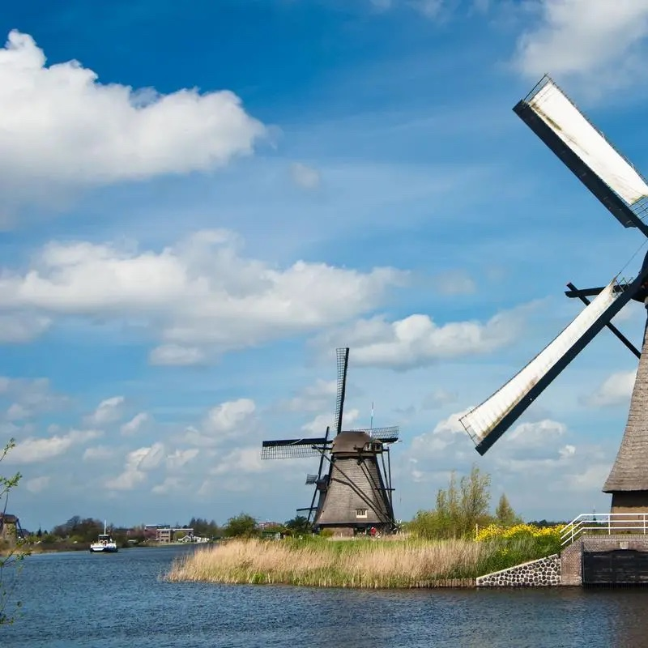
    
   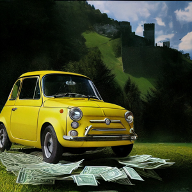
    
    <br>
    &ensp;&ensp;&ensp;&ensp;&ensp;&ensp;&ensp;&ensp;&ensp;The windmill is spinning.
 &ensp;&ensp;&ensp;&ensp;&ensp;&ensp;&ensp;&ensp;&ensp;&ensp;&ensp;&ensp;&ensp;&ensp;&ensp;&ensp;&ensp;&ensp;&ensp;&ensp;A yellow car is running on the grass.
 &ensp;&ensp;
 <br>
    <br>
    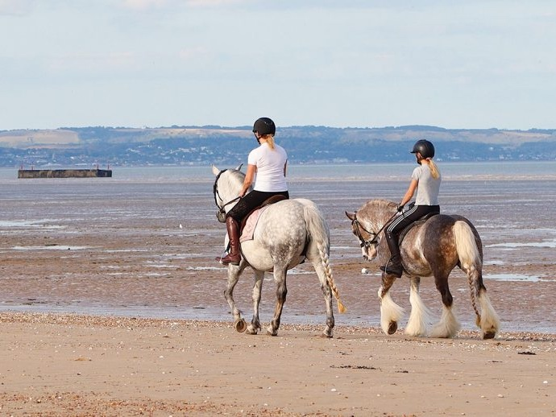
    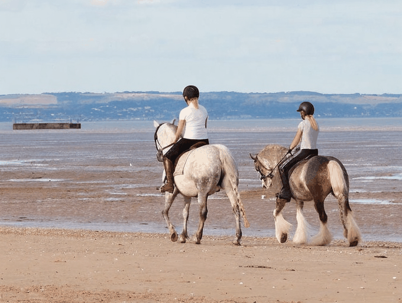
    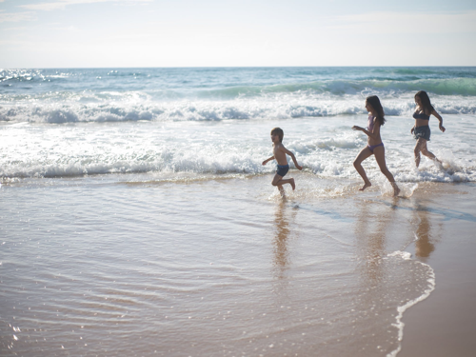
    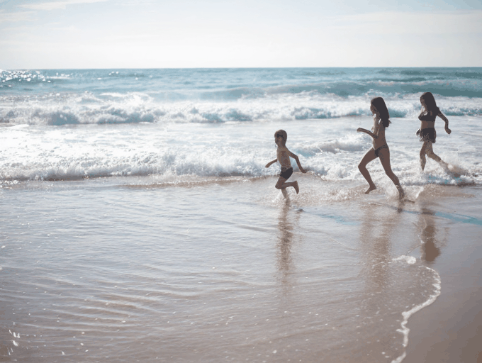
    <br>
   &ensp;&ensp;&ensp;&ensp;&ensp;&ensp;&ensp;&ensp; Two women are riding horses on the beach.&ensp;&ensp;&ensp;A boy and two girls are running on the beach.&ensp;&ensp;&ensp;&ensp;&ensp;&ensp;&ensp;
</center>

<br>

<br>

## 🎦&nbsp; Animate Image with Text and Motion Area &nbsp;🎦
- &ensp;🔥🔥🔥 The cases of single mask

<center class = "half">
    <br>
    Reference Image&ensp;&ensp;&ensp;&ensp;&ensp;&ensp;&ensp;&ensp;&ensp;&ensp;&ensp;&ensp;&ensp;&ensp;&ensp;&ensp;&ensp;&ensp;&ensp;&ensp;Masks&ensp;&ensp;&ensp;&ensp;&ensp;&ensp;&ensp;&ensp;&ensp;&ensp;&ensp;&ensp;&ensp;&ensp;&ensp;&ensp;&ensp;&ensp;&ensp;&ensp;&ensp;&ensp;&ensp;Results&ensp;&ensp;&ensp;&ensp;&ensp;
    <br>
    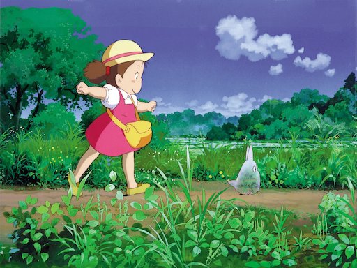
   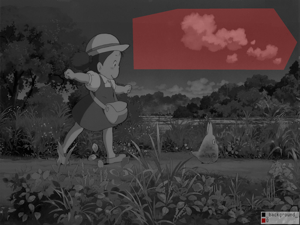
   
   <br>
   The clouds are moving to the left.
   <br>
   <br>
   
   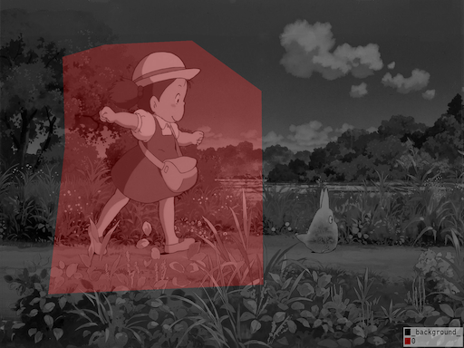
   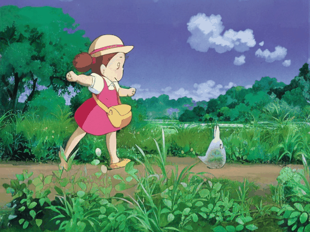
   <br>
   The girl is walking in the forest.
   <br>
   <br>
    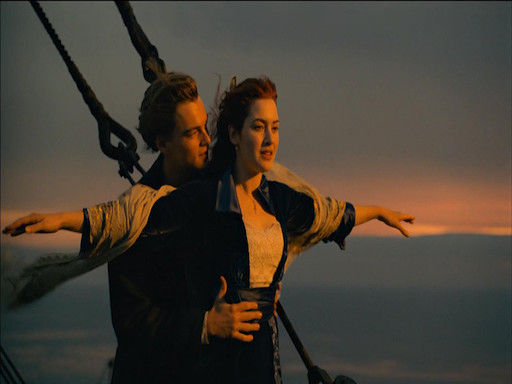
    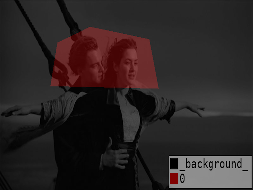
   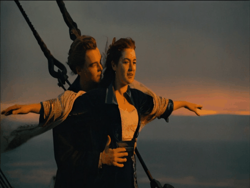
   <br>
   The couple is having an intimate conversation.
   <br>
   <br>
    
    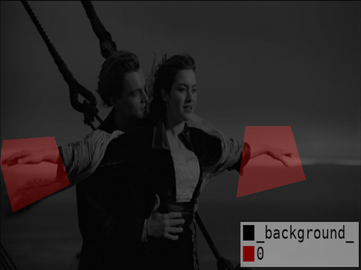
   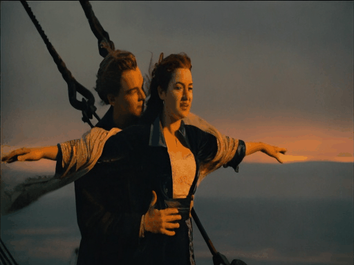
   <br>
   &ensp;&ensp;The woman is waving her hands.&ensp;
   <br>
   <br>
    
    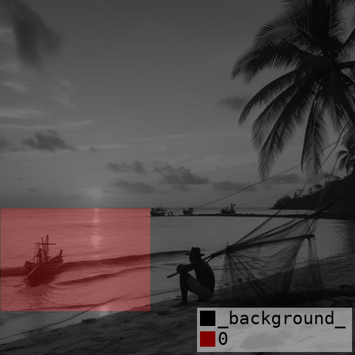
     
    <br>
    &ensp;A small boat sails in the sea.
    <br>
   <br>
    
    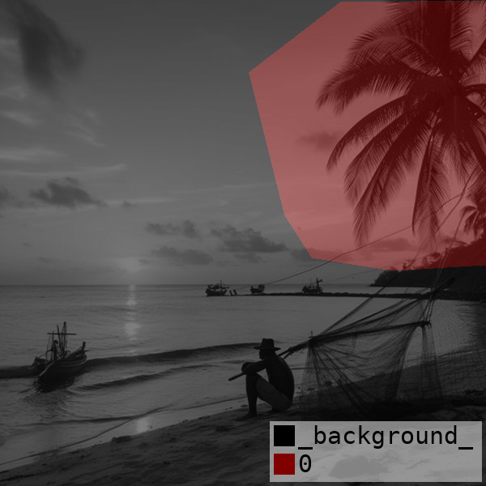
     
    <br>
    &ensp;The coconut tree is blowing in the wind.
   <br>
   <br>
    
    
     
    <br>
    &ensp;The snow is falling slowly.
    <br>
   <br>
    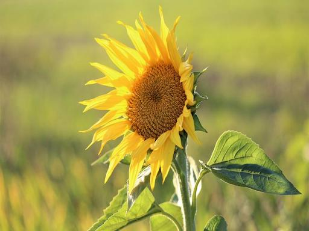
    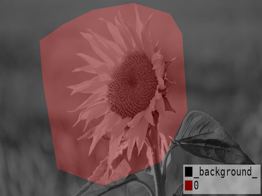
     
    <br>
    &ensp;&ensp;&ensp;The sunflower is blowing in the wind.
     <br>
   <br>
    
    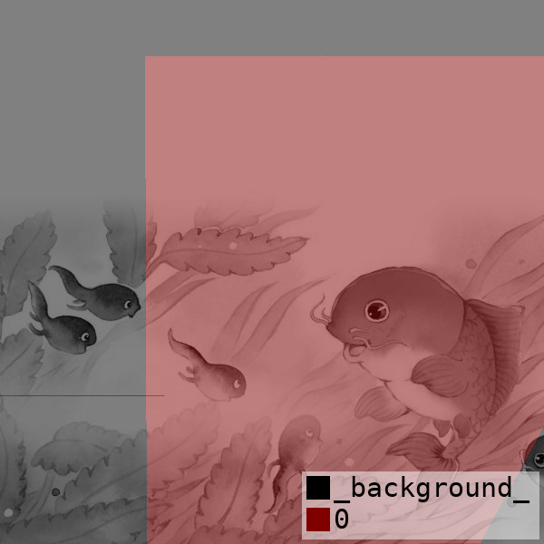
     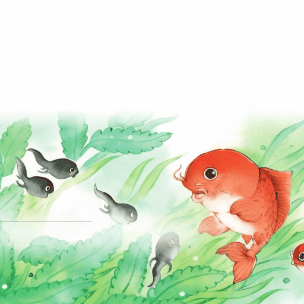
    <br>
    &ensp;&ensp;&ensp;The fish and tadpoles are playing.

</center>
<br>
<br>

- &ensp;🔥🔥🔥 The cases of multiple masks

<center class = "half">
    <br>
    Reference Image&ensp;&ensp;&ensp;&ensp;&ensp;&ensp;&ensp;&ensp;&ensp;&ensp;&ensp;&ensp;&ensp;&ensp;&ensp;&ensp;&ensp;&ensp;&ensp;&ensp;Masks&ensp;&ensp;&ensp;&ensp;&ensp;&ensp;&ensp;&ensp;&ensp;&ensp;&ensp;&ensp;&ensp;&ensp;&ensp;&ensp;&ensp;&ensp;&ensp;&ensp;&ensp;&ensp;&ensp;Results&ensp;&ensp;&ensp;&ensp;&ensp;
    <br>
     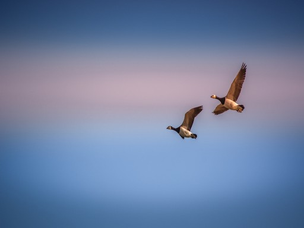
    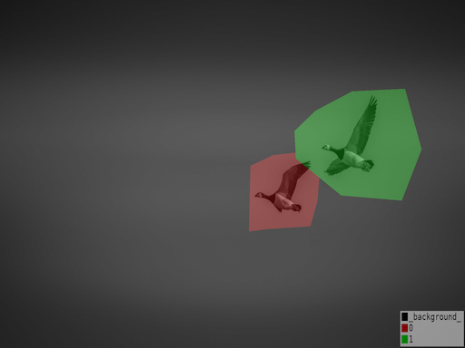
     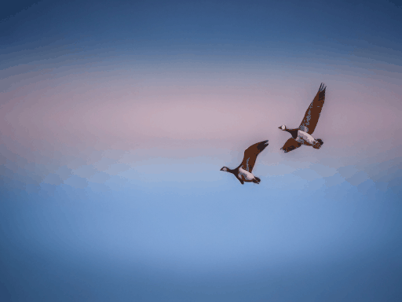
     <br>
     Two wild geese flying in the air.
    <br>
    <br>
     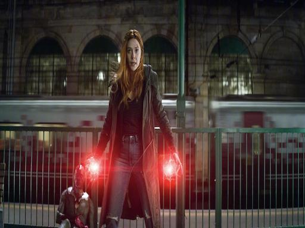
    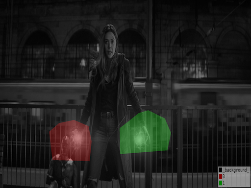
     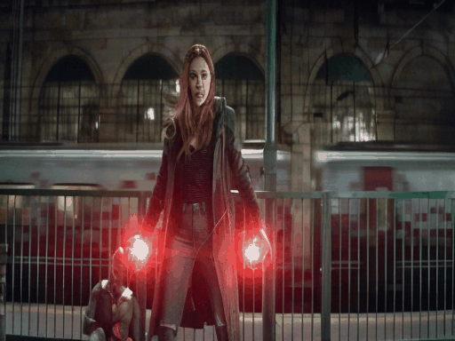
     <br>
     Scarlet Witch is casting a spell.
     <br>
    <br>
     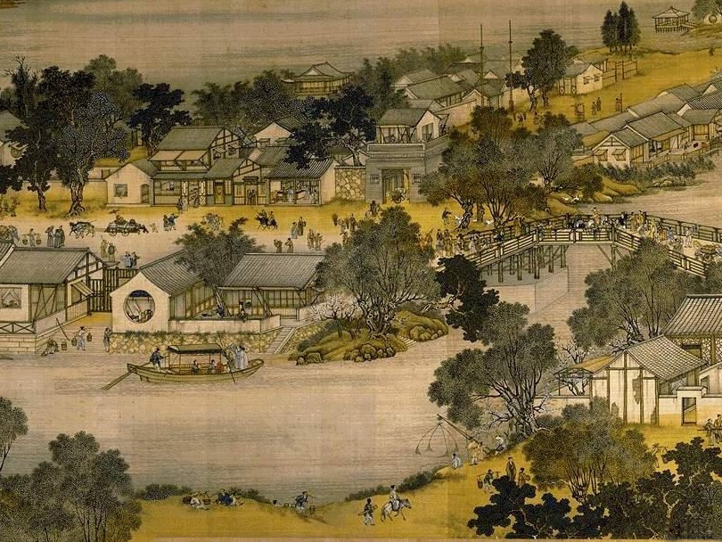
    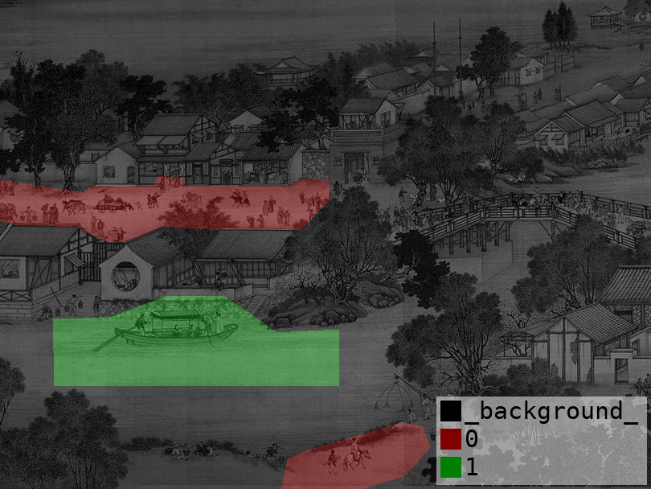
     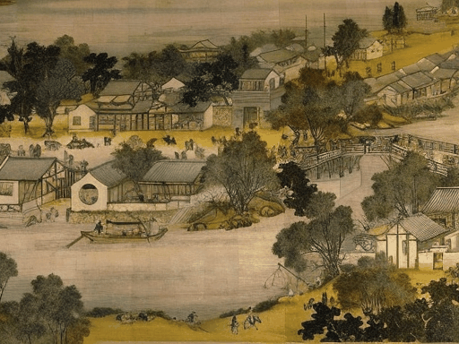
     <br>
    People are walking. The ship sailed on the water.
     <br>
    <br>
     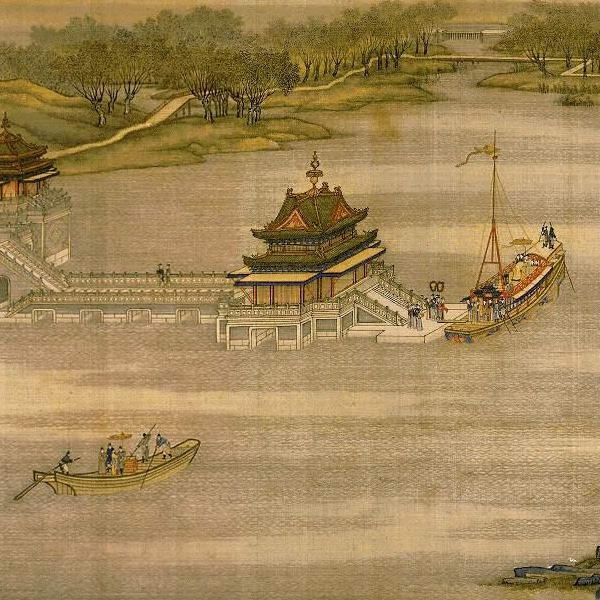
    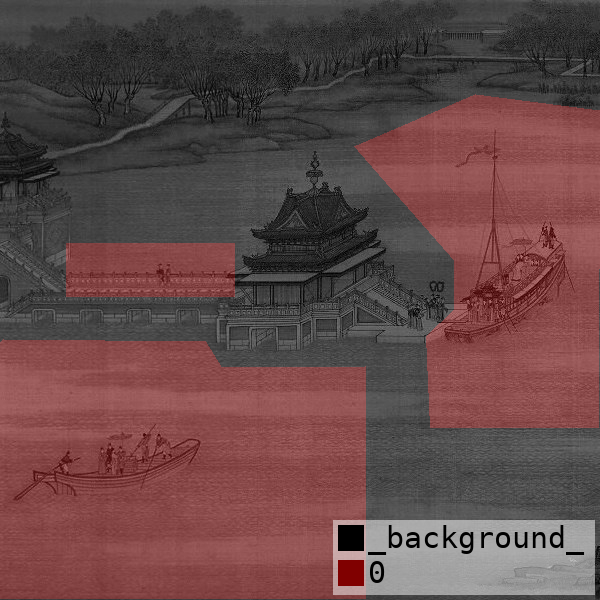
     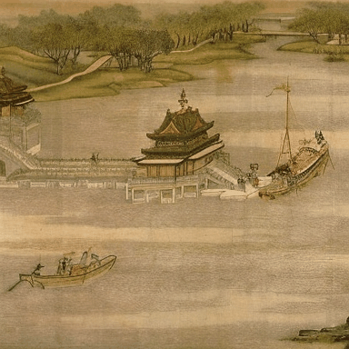
     <br>
    The ship sailed on the water.

</center>
<br>

## 💪 &nbsp; Different values of motion strength  &nbsp;💪 
<center class = "half">
    <br>
    &ensp;&ensp;&ensp;Reference Image&ensp;&ensp;&ensp;&ensp;&ensp;&ensp;motion strength=5&ensp;&ensp;&ensp;&ensp;&ensp;&ensp;motion strength=10&ensp;&ensp;&ensp;&ensp;motion strength=20&ensp;&ensp;&ensp;&ensp;motion strength=30&ensp;&ensp;&ensp;
    <br>
      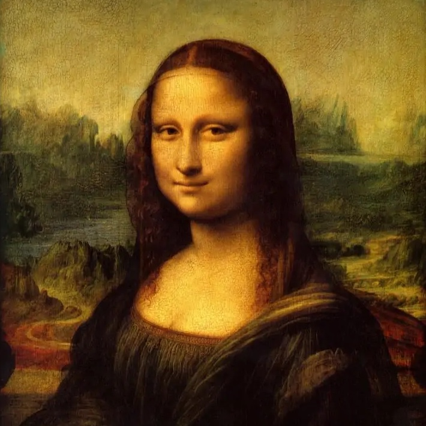
    
     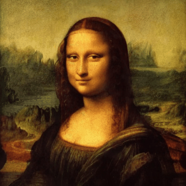
         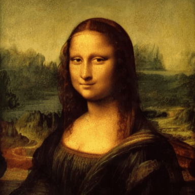
     
    <br>
    A woman is smiling.
     <br>
     <br>
      
    
     
         
     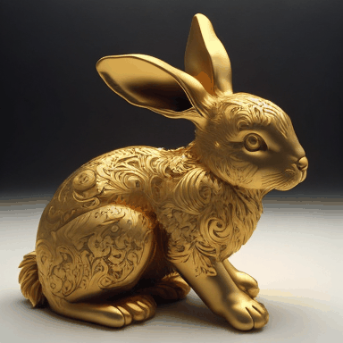
    <br>
    A gold rabbit moves hand.
</center>
<br>

## 🆚 &nbsp; Compare to other methods  &nbsp;🆚 
<center class = "half">
    <br>
    Reference Image&ensp;&ensp;&ensp;&ensp;&ensp;&ensp;&ensp;VideoComposer&ensp;&ensp;&ensp;&ensp;&ensp;&ensp;&ensp;&ensp;&ensp;&ensp;&ensp;Gen-2&ensp;&ensp;&ensp;&ensp;&ensp;&ensp;&ensp;&ensp;&ensp;&ensp;&ensp;&ensp;&ensp;&ensp;&ensp;VideoCraft1&ensp;&ensp;&ensp;&ensp;&ensp;&ensp;&ensp;&ensp;&ensp;&ensp;&ensp;&ensp;&ensp;&ensp;ours&ensp;&ensp;&ensp;&ensp;&ensp;
    </br>
      
    
     
         
     
     <br>
     A woman is smiling.
     <br>
      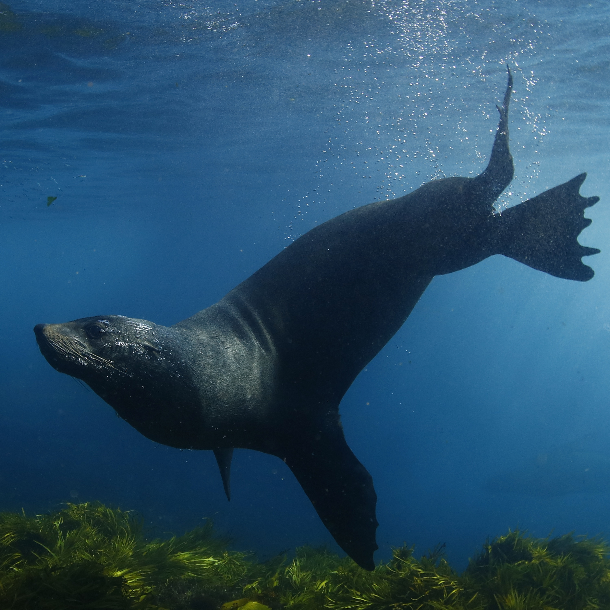
    
     
         
     
     <br>
    A seal is swimming.          
         <br>
      
    
     
         
     
     <br>
     A woman is smiling.
    <br>
      
    
     
         
     
     <br>
     A statue is laughing.


```
@misc{dai2023finegrained,
        title={Fine-Grained Open Domain Image Animation with Motion Guidance}, 
        author={Zuozhuo Dai and Zhenghao Zhang and Yao Yao and Bingxue Qiu and Siyu Zhu and Long Qin and Weizhi Wang},
        year={2023},
        eprint={2311.12886},
        archivePrefix={arXiv},
        primaryClass={cs.CV}
}
```

